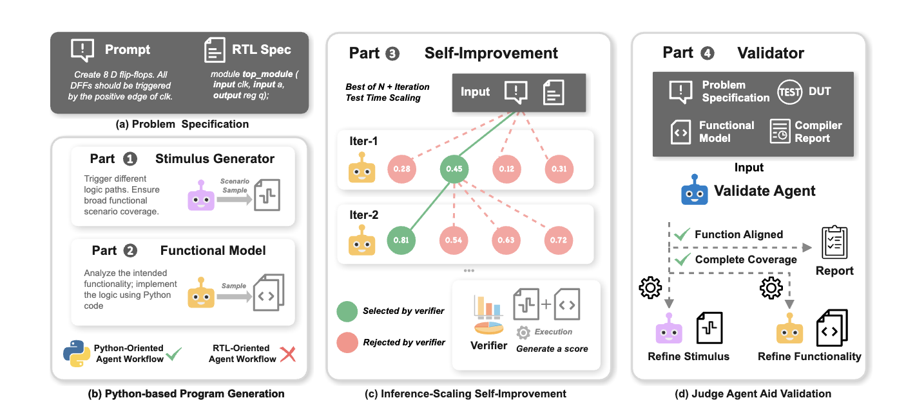

# Pro-V: An Efficient Program Generation Multi-Agent System for Automatic RTL Verification




## Environment Set Up

### 1.> To install the repo itself:
```
git clone 
# To get submodules at the same time
cd MAGE

# Install conda first if it's not on your machine like "apt install conda"
# To confirm successful installation of conda, run "conda --version"
# Continue after successfully installed conda
conda create -n mage python=3.11
conda activate mage
pip install -Ue .
```

### 2.>To set api key：
You can either:
1. Set "OPENAI_API_KEY", "ANTHROPIC_API_KEY" or other keys in your env variables
2. Create key.cfg file. The file should be in format of:

```
OPENAI_API_KEY= 'xxxxxxx'

VERTEX_SERVICE_ACCOUNT_PATH= 'xxxxxxx'
VERTEX_REGION= 'xxxxxxx'
```


#### Ubuntu (Local Compilation)
```
apt install -y autoconf gperf make gcc g++ bison flex
```
and
```
$ git clone https://github.com/steveicarus/iverilog.git && cd iverilog \
        && git checkout v12-branch \
        && sh ./autoconf.sh && ./configure && make -j4\
$ sudo make install
```
#### MacOS
```
brew install icarus-verilog
```

#### Version confirmation of iverilog
Please confirm the iverilog version is v12 by running
```
iverilog -v
```

First line of output is expected to be:
```
Icarus Verilog version 12.0 (stable) (v12_0)
```

### 3.>  Verilator Installation

```
# By apt
sudo apt install verilator

# By Brew
brew install verilator

# By Compilation
git clone https://github.com/verilator/verilator
cd verilator
autoconf
export VERILATOR_ROOT=`pwd`
./configure
make -j4
```

### 4.> Pyverilog Installation

```
# pre require
pip3 install jinja2 ply

git clone https://github.com/PyHDI/Pyverilog.git
cd Pyverilog
# must to user dir, or error because no root
python3 setup.py install --user
```

### 5.> To get benchmarks

```
[verilog-eval](https://github.com/NVlabs/verilog-eval)
```

```
git submodule update --init --recursive
```

## File structure
```
.
├── README.md
├── action.yml
├── requirements.txt
├── setup.py
├── src
│   └── mage_rtl
│       ├── agent.py
│       ├── bash_tools.py
│       ├── benchmark_read_helper.py
│       ├── gen_config.py
│       ├── log_utils.py
│       ├── prompts.py
│       ├── rtl_editor.py
│       ├── rtl_generator.py
│       ├── sim_judge.py
│       ├── sim_reviewer.py
│       ├── tb_generator.py
│       ├── token_counter.py
│       └── utils.py
├── testbench_generate.ipynb
└── tests
    ├── test_llm_chat.py
    ├── test_rtl_generator.py
    ├── test_single_agent.py
    └── test_top_agent.py
```

## Run Guide
```
cd tests
python test_llm_chat.py
```

Run arguments can be set in the file like:

```
args_dict = {
    "provider": "anthropic",
    "model": "claude-3-5-sonnet-20241022",
    # "model": "gpt-4o-2024-08-06",
    # "filter_instance": "^(Prob070_ece241_2013_q2|Prob151_review2015_fsm)$",
    "filter_instance": "^(Prob011_norgate)$",
    # "filter_instance": "^(.*)$",
    "type_benchmark": "verilog_eval_v2",
    "path_benchmark": "../verilog-eval",
    "run_identifier": "your_run_identifier",
    "n": 1,
    "temperature": 0.85,
    "top_p": 0.95,
    "max_token": 8192,
    "use_golden_tb_in_mage": True,
    "key_cfg_path": "key.cfg",
}
```
Where each argument means:
1. provider: The api provider of the LLM model used. e.g. anthropic-->claude, openai-->gpt-4o
2. model: The LLM model used. Support for gpt-4o and claude has been verified.
3. filter_instance: A RegEx style instance name filter.
4. type_benchmark: Support running verilog_eval_v1 or verilog_eval_v2
5. path_benchmark: Where the benchmark repo is cloned
6. run_identifier: Unique name to disguish different runs
7. n: Number of repeated run to execute
8. temperature: Argument for LLM generation randomness. Usually between [0, 1]
9. top_p: Argument for LLM generation randomness. Usually between [0, 1]
10. max_token: Maximum number of tokens the model is allowed to generate in its output.
11. key_cfg_path: Path to your key.cfg file. Defaulted to be under MAGE


## Development Guide

Setup pre-commit like:
```
pre-commit install
```

# TableExtractor

这是一个用于从规格说明文本中提取表格式内容并转换为结构化字典的Python工具。

## 功能特点

- 使用GPT-4模型识别和提取文本中的表格结构
- 支持多表格提取
- 自动识别行标题和列标题
- 将表格数据转换为结构化的字典格式
- 提供易读的表格输出格式化功能

## 安装

1. 克隆此仓库
2. 安装依赖：
```bash
pip install -r requirements.txt
```

## 使用方法

1. 首先，设置您的OpenAI API密钥。您可以通过以下两种方式之一进行设置：
   - 在环境变量中设置 `OPENAI_API_KEY`
   - 在创建 `TableExtractor` 实例时直接传入API密钥

2. 基本使用示例：

```python
from table_extractor import TableExtractor

# 创建实例
extractor = TableExtractor(api_key="your-api-key")  # 或者不传入api_key，从环境变量获取

# 示例文本
text = """
规格说明：
型号规格表：
型号  | 尺寸  | 重量
A100  | 10cm  | 100g
B200  | 20cm  | 200g
"""

# 提取表格
tables = extractor.extract_tables(text)

# 格式化输出
for table in tables:
    print(extractor.format_table(table))
```

## 输出格式

提取的表格将被转换为以下格式的字典：

```python
{
    "row_headers": ["A100", "B200"],
    "column_headers": ["型号", "尺寸", "重量"],
    "data": [
        {
            "row_header": "A100",
            "values": {
                "型号": "A100",
                "尺寸": "10cm",
                "重量": "100g"
            }
        },
        {
            "row_header": "B200",
            "values": {
                "型号": "B200",
                "尺寸": "20cm",
                "重量": "200g"
            }
        }
    ]
}
```

## 注意事项

- 需要有效的OpenAI API密钥
- 建议将API密钥存储在环境变量中，而不是硬编码在代码中
- 处理大量文本时要注意API使用限制和成本
